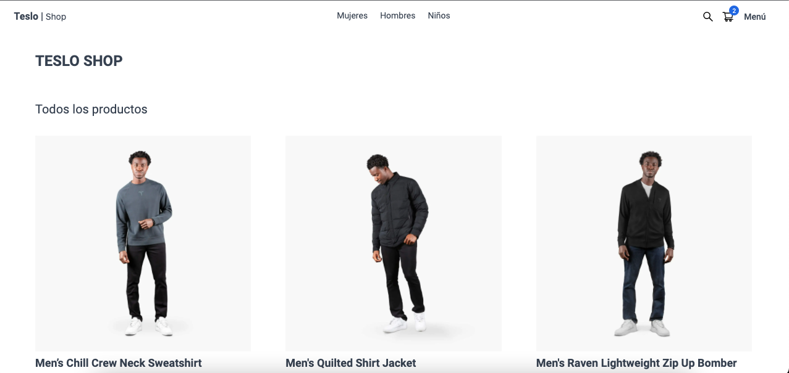

# Teslo Shop web



### Empezando

El archivo .env.example renombrar a .env

```bash
NEXT_PUBLIC_URL_API= #url del backend
URL_API= #url del backend


# next auth
NEXTAUTH_SECRET= # Random key

FACEBOOK_CLIENT_ID= #cliente id de facebook
FACEBOOK_CLIENT_SECRET= #clave secreta de facebook

GOOGLE_CLIENT_ID= #cliente id de google
GOOGLE_CLIENT_SECRET= #clave secreta de google

GITHUB_ID= #cliente id de github
GITHUB_SECRET= #clave secreta de github

# paypal
NEXT_PUBLIC_PAYPAL_CLIENT_ID= # clave publica de paypal
```

* Backend: [teslo-shop-api](https://github.com/jonathanleivag/teslo-shop-api)

Primero, ejecute el servidor de desarrollo:

```bash
npm install
npm run dev
# or
yarn
yarn dev
```

Abra [http://localhost:3000](http://localhost:3000) con su navegador para ver el resultado.

### Rutas

```bash
# auth
Login -> http://localhost:3000/auth/login
Registrar -> http://localhost:3000/auth/register

# cart
carrito vacío -> http://localhost:3000/cart/empty
carrito -> http://localhost:3000/cart

#verificación
dirección -> http://localhost:3000/checkout/address
historial de dirección -> http://localhost:3000/checkout/address/history
Resumen -> http://localhost:3000/checkout/summary

#ordenes
orden por id -> http://localhost:3000/orders/[id]
Historial de compra -> http://localhost:3000/orders/history

#productos
ver producto -> http://localhost:3000/product/slug

# admin
dashboard -> http://localhost:3000/admin

#raiz
404
home -> http://localhost:3000/
```

# License

copia de la pag de tesla, imagenes sacada de la pagína de tesla, no utilizar estas imagenes

Free Software, Hell Yeah!